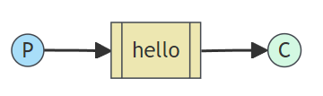
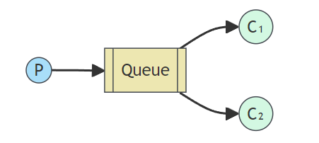
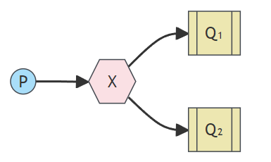
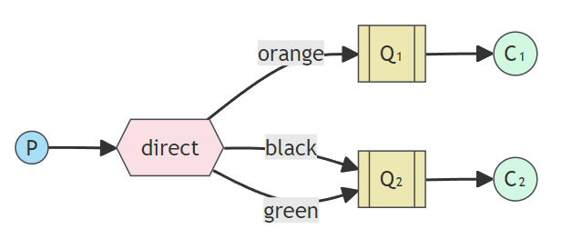
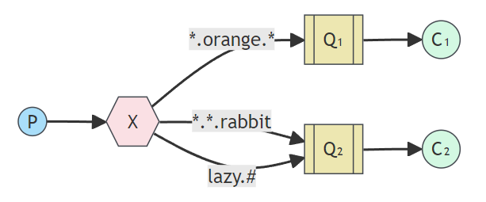

### 消息队列学习笔记

---

消息队列是应用程序之间的通信方法；无需即时返回的且耗时的操作进行异步处理从而提高系统的吞吐量；可以实现程序之间的解耦合。

* 实现方式：AMQP、JMS
* 常见的消息队列：activeMQ、zeroMQ、**RebbitMQ**、RocketMQ、**kafka**

##### 消息队列MQ

---

MQ全称为Message Queue，消息队列是应用程序和应用程序之间的通信方法。

1. 为什么使用 MQ

   在项目中，可将一些无需即时返回且耗时的操作提取出来，进行异步处理，而这种异步处理的方式大大的节省了服务器的请求响应时间，从而提高了系统的吞吐量。

2. 开发中消息队列通常有如下应用场景：

   1、任务异步处理将不需要同步处理的并且耗时长的操作由消息队列通知消息接收方进行异步处理。提高了应用程序的响应时间。

   2、应用程序解耦合 MQ 相当于一个中介，生产方通过MQ与消费方交互，它将应用程序进行解耦合。

#### AMQP 和 JMS

---

MQ是消息通信的模型；实现MQ的大致有两种主流方式：AMQP、JMS。

##### AMQP

AMQP是一种协议，更准确的说是一种binary wire-level protocol（链接协议）。这是其和JMS的本质差别，AMQP 不从API层进行限定，而是直接定义网络交换的数据格式。

##### JMS

JMS即Java消息服务（JavaMessage Service）应用程序接口，是一个Java平台中关于面向消息中间件（MOM）的 API，用于在两个应用程序之间，或分布式系统中发送消息，进行异步通信。

##### AMQP 和 JMS 的区别

* JMS是定义了统一的接口，来对消息操作进行统一；AMQP是通过规定协议来统一数据交互的格式
* JMS限定了必须使用Java语言；AMQP只是协议，不规定实现方式，因此是跨语言的。
* JMS规定了两种消息模式；而AMQP的消息模式更加丰富

### 消息队列的产品

---

#### RebbitMQ

RabbitMQ是由erlang语言开发，基于AMQP（Advanced Message Queue 高级消息队列协议）协议实现的消息队 列，它是一种应用程序之间的通信方法，消息队列在分布式系统开发中应用非常广泛。 

> RabbitMQ官方地址：http://www.rabbitmq.com/ 

RabbitMQ提供了6种模式：简单模式，work模式，Publish/Subscribe发布与订阅模式，Routing路由模式，Topics 主题模式，RPC远程调用模式（远程调用，不太算MQ；不作介绍）；

> 官网对应模式介绍：https://www.rabbitmq.com/getstarted.html
---
#### 简单模式

生产者发送消息到队列中，一个消费者从队列中接收消息

> 在RabbitMQ中消费者只能从队列接收消息
>
> 如果在同一个队列中接收消息的消费者有多个时，如何分配消息?
---
#### 工作队列模式

生产者发送消息到队列中，多个消费者从队列中接收消息，消费者之间是竞争关系

>一个消息只能被一个消费者接收，其他消费者是不能接收到同一条消息的
> 
> 可以在消费者端处理任务比较耗时的时候，添加对同一队列的消费者来提高任务处理能力
---
#### 发布/订阅模式

多了一个角色Exchange交换机，接收生产者发送的消息并决定如何投递消息到其绑定的队列；消息的投递决定于交换机的类型。

交换机类型：广播（fanout）、定向（direct）、通配符（topic）

>交换机只做数据转发，自身不存储数据

发布与订阅模式特点：一个消息可以被多个消费者接收；其实是使用了订阅模式，交换机类型为：fanout广播

---
#### 路由模式

生产者发送消息，通过交换机（direct模式）转发到特定路由key的消息队列，消费者接收

>消息发送时需要携带路由key，只有消息的路由key与队列路由key完全一致才能让队列接收到消息

---
#### 通配符模式

可以根据路由key将消息传递到对应路由key的队列；队列绑定到交换机的路由key可以有多个；通配符模式中路由key可以使用 `*` 和 `#` ；使用了通配符模式之后对于路由Key的配置更加灵活。

